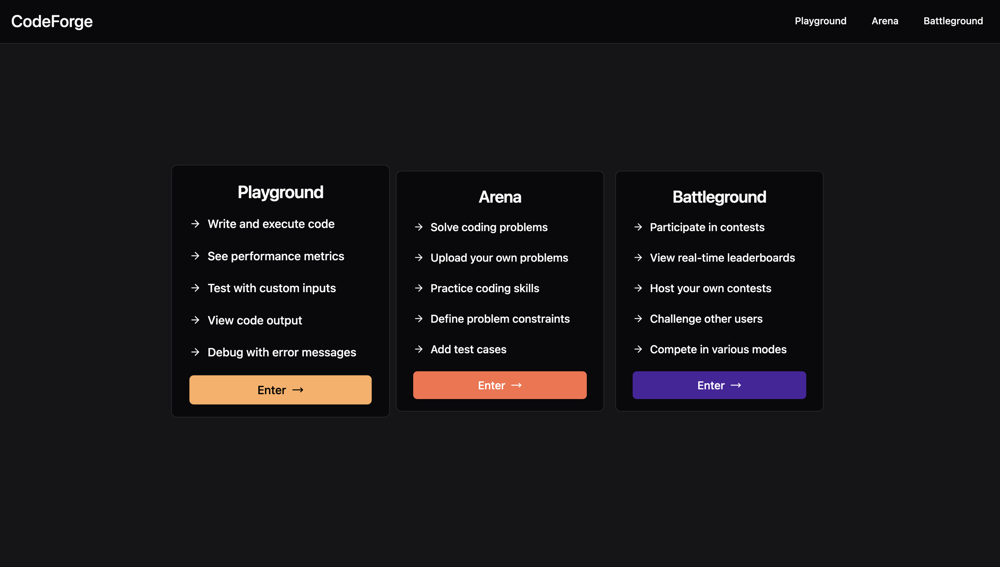
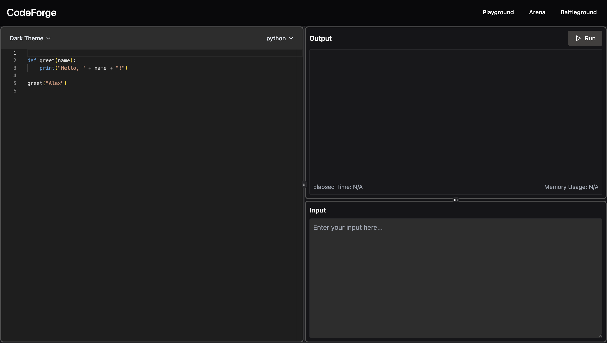
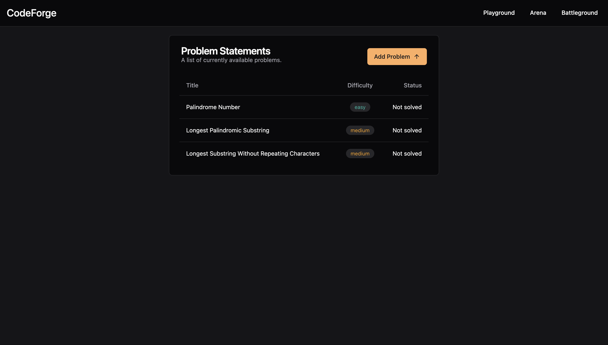
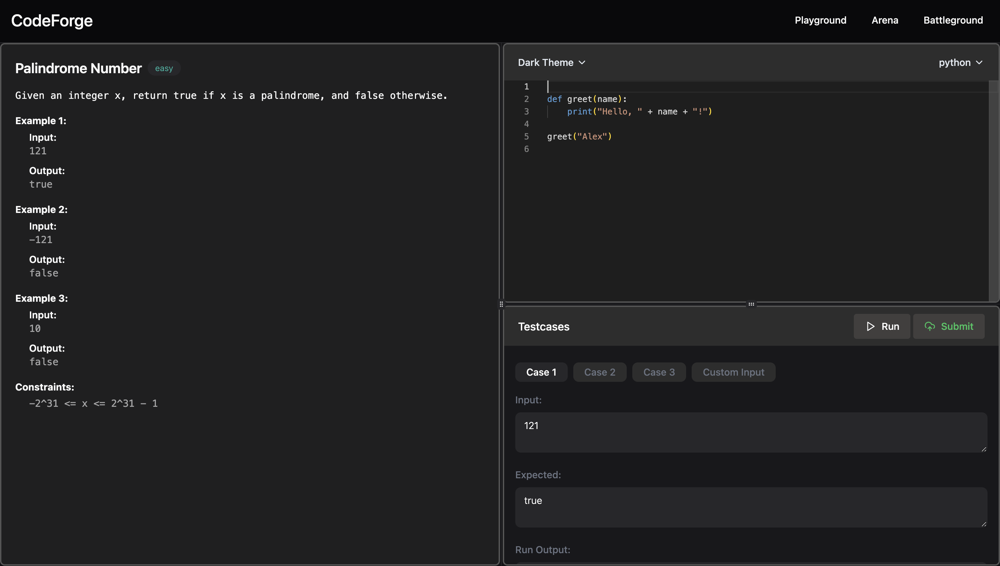
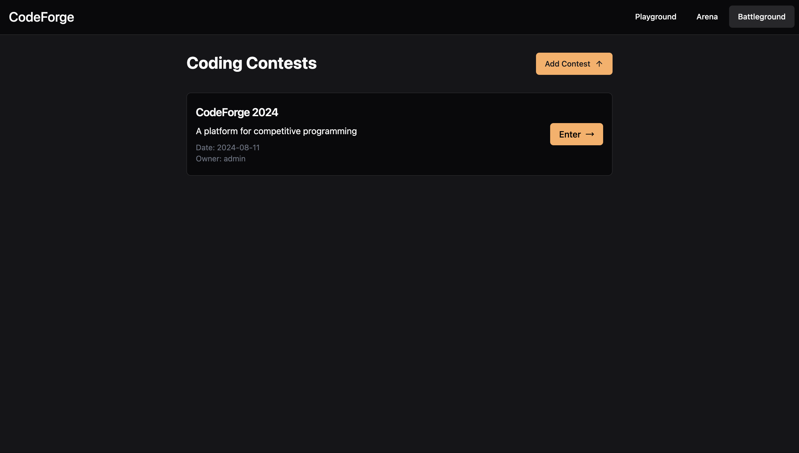
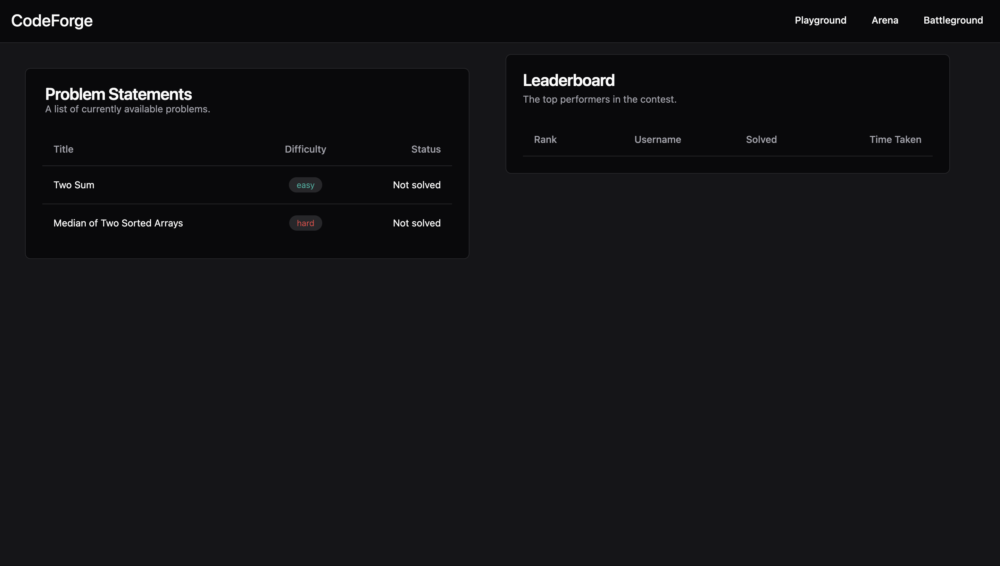

## Tech Stack

### Frontend

- **React.js**: JavaScript library for building user interfaces.
- **axios**: Promise-based HTTP client for the browser and Node.js.

### Backend

- **fastapi**: Web framework for building APIs with Python.
- **SQLModel**: ORM for FastAPI that simplifies SQL operations.

### Database

- **SQLite**: Serverless, self-contained SQL database engine used temporarily for development.

## References

- **[Monaco Editor for React](https://github.com/react-monaco-editor/react-monaco-editor)**: Integrates the Monaco Editor into React applications, providing a powerful, customizable code editor with features such as syntax highlighting and auto-completion.
- **[NsJail](https://github.com/google/nsjail)**: Tool for isolating processes using Linux namespaces and seccomp filters, creating secure and controlled execution environments.

## Installation

### Frontend

#### React + TypeScript + Vite

This template provides a minimal setup for React with Vite, including Hot Module Replacement (HMR) and ESLint rules. Two official plugins are available:

- [@vitejs/plugin-react](https://github.com/vitejs/vite-plugin-react): Uses Babel for Fast Refresh.
- [@vitejs/plugin-react-swc](https://github.com/vitejs/vite-plugin-react-swc): Uses SWC for Fast Refresh.

#### Expanding ESLint Configuration

For production applications, update the ESLint configuration to include type-aware lint rules:

1. Configure `parserOptions`:

   ```js
   export default tseslint.config({
     languageOptions: {
       parserOptions: {
         project: ["./tsconfig.node.json", "./tsconfig.app.json"],
         tsconfigRootDir: import.meta.dirname,
       },
     },
   });
   ```

2. Replace `tseslint.configs.recommended` with `tseslint.configs.recommendedTypeChecked` or `tseslint.configs.strictTypeChecked`.
3. Optionally add `...tseslint.configs.stylisticTypeChecked`.
4. Install [eslint-plugin-react](https://github.com/jsx-eslint/eslint-plugin-react) and update the configuration:

   ```js
   // eslint.config.js
   import react from "eslint-plugin-react";

   export default tseslint.config({
     settings: { react: { version: "18.3" } },
     plugins: {
       react,
     },
     rules: {
       ...react.configs.recommended.rules,
       ...react.configs["jsx-runtime"].rules,
     },
   });
   ```

### Backend

#### Setup

1. Install `uv`:

   ```bash
   curl -LsSf https://astral.sh/uv/install.sh | sh
   ```

   Relaunch the terminal after installation.

2. Set up a virtual environment:

   ```bash
   uv sync
   ```

   This creates a `.venv` directory inside the backend folder.

3. Select the Python interpreter in VSCode:

   - Open a Python file in VSCode.
   - Click on the Python version in the bottom right corner.
   - Select: Enter interpreter path > Find.
   - Choose `.venv/bin/python` as the interpreter.
   - Relaunch the terminal after selecting.

#### Running the Server

In the backend folder, run:

```bash
fastapi dev src/api
```

## Demo Screenshots

### Home Page


_Overview of the main interface and features._

### Playground


_Area for testing and running code._

### Arena


_Section for participating in competitive coding challenges._

### Problem


_Problem statement with details and constraints, editor, input and output._

### Battleground


_Area for engaging in coding contests._

### Contest


_Page displaying a specific contest problems along with its leaderboard._
